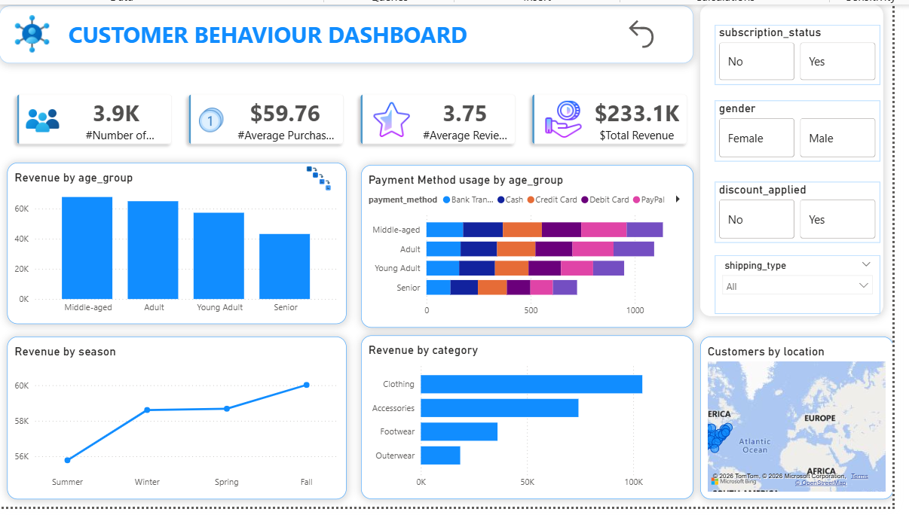

# customer-behavior-dashboard
Customer Behavior Analysis using Python (Pandas), SQL, and Power BI Dashboard

## Dashboard Preview

## Project Workflow

1. Data Cleaning using Pandas  
2. SQL Analysis (10 business questions)  
3. Dashboard creation in Power BI  

## Tools Used

- Python (Pandas)
- SQL Server
- Power BI
